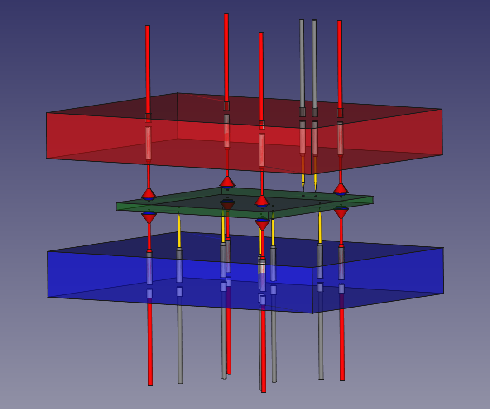
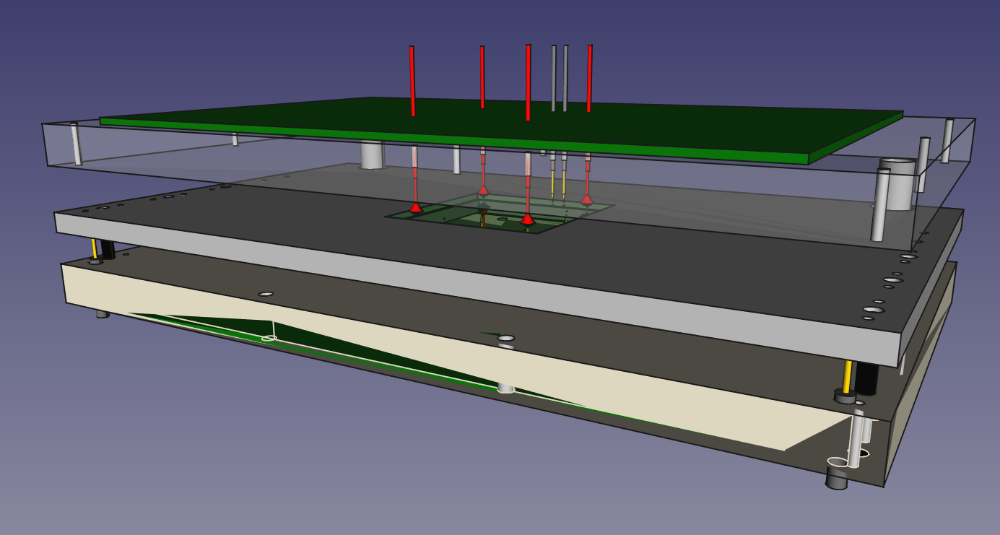

# TestPointReport2STL
This is an *OpenSCAD* script to convert a csv file containing a PCB test point report - generated e.g. from *Altium Designer*, *KiCAD*, *Eagle* or any other PCB design software - into a 3D model of a holder for mounting test probes for electrical tests.

In its simplest form the output is a rectangular block with holes for mounting the test probes into. The script generates one block for top (in red) and one for bottom (in blue), with a size enclosing the test point positions plus any extra space defined by borderx and bordery.
These two blocks can then be manufactured e.g. by 3D printing or any other means.

Optional test probes can be displayed (showpins=true), as well as a complete test fixture can be generated (drawmountingsystem=true).
The default test probe geometry corresponds to *QATech.com* probe *075-PRP259RS-S* and sockets *075-SDN250S*, see https://www.qatech.com/downloads/075-25/075-25_Catalog.pdf.
The test fixture is based on the *WA-M-1200* fixture by *GPS-Prüftechnik GmbH* with the *WA-AP-100* pressure plate, *WA-PAP-100* mounting plate and *WA-M-1200* contact plate. The exact model of the test fixture is however still work in progress. For details on the mounting system used see https://www.gps-prueftechnik.de/_downloads_DE/WA-M-12xx.pdf.

All dimensions used by the script are metric.

## Usage

1. Convert your test point data into an *OpenSCAD* vector by using one of the methods described below.
2. Insert the data into the *OpenSCAD* script, either into the code or by using the *OpenSCAD Customizer*.
3. Configure the output options, again, either into the code or by using the *OpenSCAD Customizer*. You can also load predifined options in the *Customizer*.
4. Run the *OpenSCAD* script in *OpenSCAD* or *FreeCAD*.
5. Animate in *OpenSCAD* if you want to see what happens.
6. Export the geometry and edit if desired.
7. Manufacture the test probe fixtures, e.g. by 3D printing.
8. Assemble the test fixture.
9. Happy Testing!

## Test point data representation
The test point data is represented as list, implemented as a multidimensional *OpenSCAD* vector named testpointdata.

    testpointdata = [
    ["signal name 1", "test point name 1", [position x, y, z], "on side", test pad hole diameter, "test probe type"],
    ["signal name 2", "test point name 2", [position x, y, z], "on side", test pad hole diameter, "test probe type"],
    ...
    ]

The list entries are as follows:
- "signal name" is the name of the signal the test point connects to. The entry is not (yet) used.
- "test point name" is the name of the test point.  The entry is not (yet) used.
- "[position x, y and z]" is a vector of the location of the test pad to connect to. The z-position value can be used to allow some of the needles to connect before others. E.g. a value of 1 has the corresponding pin 1 mm higher above the PCB thus connecting later.
- "on side" can be "Top", "Bottom" or "Both", depending on whether the test probe for the pad shall be located on top, bottom or both sides.
- "test pad hole diameter" is the diameter of the hole for a through hole test pad. If test pads are to be shown (showtestpads=true) this value is expanded by 0.1 mm to draw the pad.
- "test probe type" is the specification of the test needle shape. An empty string results in the (imaginary) default probe being used.

The currently implemented probe types are:
- QATech 050-PTP2540S
- QATech 050-PTP2541S
- QATech 050-PRP2540S
- QATech 050-PRP2541S
- QATech 075-PRP2501S
- QATech 075-PRP2510S
- QATech 075-PRP2520S
- QATech 075-PRP2540S
- QATech 075-PRP259RS-S (default)

The currently implemented sockets are:
- QATech 050-SRB255P
- QATech 050-STB255P
- QATech 075-SDN250S (default)

New probes and sockets can be added by editing the file testprobe.scad. The data for new probes goes into the module named probe(). The data for new sockets goes into the module socket() and into the model pinhole(). The later takes care of making the actual holes to fit the socket and probes into.

The script is not (yet) testing whether the selected probes and sockets match.

## Convert test point data to *OpenSCAD* from a csv file
The entries for the testpointdata vector can easily be generated from a csv file generated by your layout software.
One option is using the following Microsoft Excel formula. The columns expected in the csv file for the below formula are as follows:

    A: Signal name
    B: Test point name
    C: x-pos in mm, ending in mm
    D: y-pos in mm, ending in mm
    E: Test point orientation, either "Top", "Bottom" or "Both".
    F: Test pad diameter
    G: Test probe type (if empty the script will use the default probe)
    H: Test socket type (if empty the script will use the default socket)

Formula for English language *Excel*:

    =IF(ROW()=2;"[";"")&"["""&A2&""","""&B2&""",["&LEFT(C2;LEN(C2)-2)&","&LEFT(D2;LEN(D2)-2)&",0],"&E2&", "&F2&","&G2&","&H2&"]"&IF(C3<>"";",";"]")

Formula for German language *Excel*:

    =WENN(ROW()=2;"[";"")&"["""&A2&""","""&B2&""",["&LINKS(C2;LÄNGE(C2)-2)&","&LINKS(D2;LÄNGE(D2)-2)&",0],"&E2&", "&F2&","&G2&","&H2&"]"&WENN(C3<>"";",";"]")

Copy these formula in a cell behind each column with test point data, by starting with row number two and then pulling down from there. If the data in your csv file is somewhat different this approach should still be easily adapted.

If you are on Linux or don't like Excel below is an awk script doing the same:

      awk -F";" 'NR > 1 {printf "[\"%s\", \"%s\", [%s,%s,0], \"%s\", %s, \"%s\", \"%s\"],\n",$1,$2,substr($3, 1, length($3)-2),substr($4, 1, length($4)-2),$5,$6,$7,$8}' testpointdata.csv

Or if it is a "real" *csv* (split character is ",") then we can use both semicolon and comma:

    awk -F"[;,]" 'NR > 1 {printf "[\"%s\", \"%s\", [%s,%s,0], \"%s\", %s, \"%s\", \"%s\"],\n",$1,$2,substr($3, 1, length($3)-2),substr($4, 1, length($4)-2),$5,$6,$7,$8}' testpointdata.csv

This script also available in testpointformat.sh which accepts the filename of the csv file as its only parameter and outputs a complete *OpenSCAD* vector representation of the test point data. The *awk* script in the file is a bit more advanced than the one shown here.

The formatted test point data can then be added into the marked area of the *OpenSCAD* script.

## OpenSCAD Customizer

A simpler way to your customized test fixture, without having to edit the OpenSCAD code directly, is to use the *OpenSCAD Customizer*.
The data for the testpointdata vector can be pasted directly into the field testpointdata in the *OpenSCAD Customizer*.

The *OpenSCAD Customizer* allows to configure all other parameters, so you really don't need to edit any code.

The *OpenSCAD Customizer* also has a few predefined settings to choose from.
1. "Default values from design" should give you the whole test fixture.
2. "Simple top fixture" gives you a simple holder block for the top test probes.
3. "Simple bottom fixture" gives you a simple holder block for the bottom test probes.
4. "Simple fixture" gives you both the beforementioned .
5. "Full fixture" gives you the whole test fixture.
6. "Full fixture double holder" gives you the whole test fixture with a second middle holder to press the *PCB* down. The second holder is an exact copy of the first holder.

The script is also available on *Thingiverse*. Visit https://www.thingiverse.com/thing:3608402.
If you are lucky and the *Thingiverse Customizer App* is working you can customize the fixture directly on *Thingiverse*, so you may not even have to install *OpenSCAD* or *FreeCAD*.

## Animation
The script supports *OpenSCAD* animation for a rough estimate of how and in which order the test pins will connect. The absolute positions and geometrical movement of the surrounding test fixture is however not (yet) fully correct. So depending on the test pin data geometry collisions will appear. The test probe animation itself should be fine though.

## STEP Output and editing in FreeCAD
If you want to get a *STEP* file directly instead of an STL file it is easiest to run this code in *FreeCAD*  as an element in the *OpenSCAD* workspace or just open the TestPointReport2STL.scad script in *FreeCAD*. Then you can export the resulting model directly as STEP from there or perform further edits. 
This has been tested to work with *FreeCAD* 0.17 and 0.19 (0.19.16624). *FreeCAD* 0.18.1 (0.18.16110) for me currently fails to display the model properly, but this seems to be a more generic problem.

Alternatively open the *STL* file generated by *OpenSCAD* in any suitable *CAD* tool and convert it to *STEP*.

## Required Software and Versions

This script has been tested with *OpenSCAD* (https://www.openscad.org) in Version 2019.01-RC4 and *FreeCAD* (https://www.freecadweb.org/) 0.17 and 0.19 (0.19.16624). 

Documentation and the latest version of this script can be found at: https://github.com/5inf/TestPointReport2STL

Ideas, improvements and bugfixes are welcome.

Enjoy!
